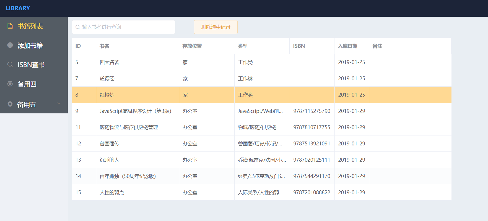
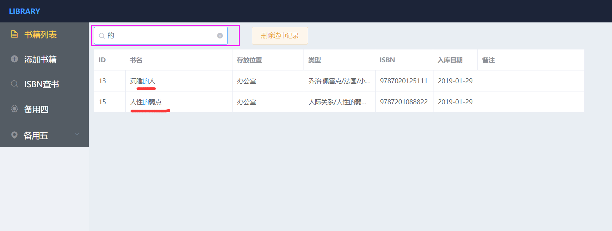
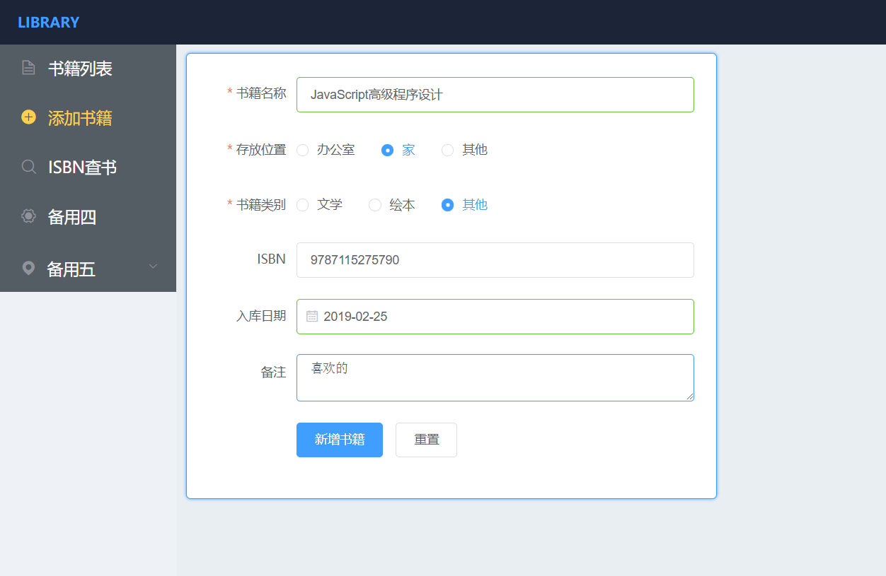
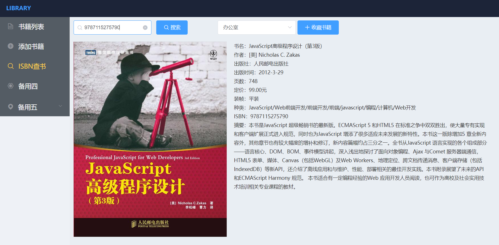

# Library  #
Vue构建的图书管理系统

### [项目线上预览地址](https://excelav.github.io/#/) ###

用于个人图书管理，记录图书位置，及其他信息，数据存储使用indexedDB存储。

在项目中主要使用：
- Vue
- element-ui 
- IndexedDB
- Jsonp
- Vuex
- Vue router
- Stylus

## 项目构成 ##

- 图书列表
- 图书查询，删除
- 提交表单添加图书
- 通过isbn网络查书，添加

## 项目部分截图 ##

